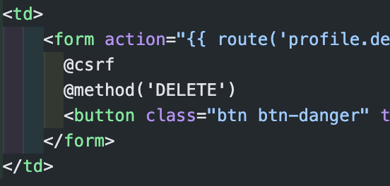

Laravel

1. Laravel 5.6
2. Login, Logout, Register default with `php artisan make:auth`
3. Create, Read, Update, Delete
4. Table profile
   1. id (auto increment - small int 5) 
   2. firstname (string 25)
   3. lastname (string 25)
   4. gender (enum L/P | Radio)
   5. Kota (enum - Jakarta, Bogot, Tangerang Bekasi | dropdown)
   6. Created_id (?) => **Belum paham perbedaan dengan id itu apa**
   7. Created_at
   8. updated_at
5. ORM laravel => Menggunakan model
6. Validasi laravel helper => 
7. CSRF => 
8. upload github public
